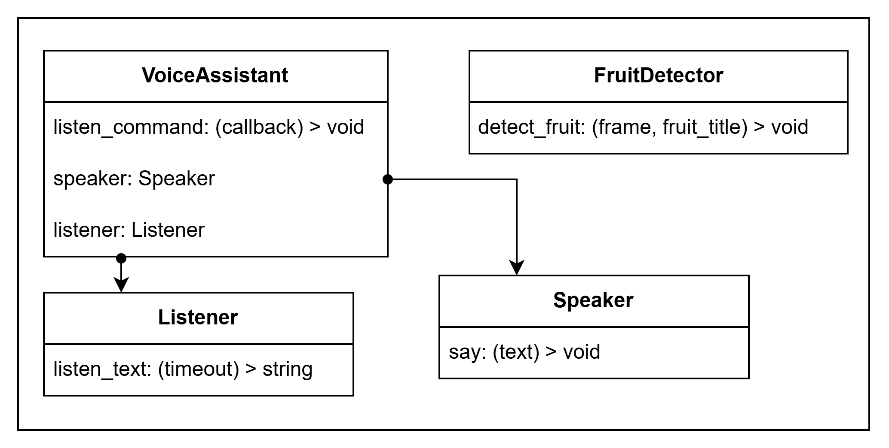

# voice-marker-detector
This project contains the script that can track the specific marker on the camera. This script is controlled by voice.

## General project description

Python (the version is 3.13.7) and libraries open-cv, vosk and pyttsx3 are used. 

The table of files' responsibilities:

| File | Responsibility |
| ---- | -------------- |
| main.py             | Launching all project flow |
| voice_assistant.py  | Detecting voice and speaking to users |
| image_detector.py   | Detecting fruit, managing camera functions |

This project is based on classes `FruitDetector` and `VoiceAssistant`. To run a camera and listen at once the threads are used, to control them the global variables were considered.
The brief description of classes types is shown in the following figure:

### Detecting fruit
This project is able to detect fruit in a frame. The possible fruit that can be detected are presented in the following table. Realization of classes for a camera is based on open-cv library. 

| Fruit Title | Lower HSV bound | Upper HSV bound |
| ----------- | --------------- | --------------- |
| Orange      | [5, 150, 150]   | [15, 255, 255]  |
| Green Apple | [40, 100, 80]   | [80, 255, 255]  |
| Tomato      | [0, 180, 120]   | [10, 255, 255]  |
| Lemon       | [20, 0, 0]      | [40, 255, 255]  |

The HSV color representation was used to find color pattern of fruit. 

The realization of the code that is responsible for the fruit detecting is in file `image_detector.py`.

### Voice assistant
The `VoiceAssistant` class consists of two classes: `Listener` and `Speaker`. The `VoiceAssistant` uses `Listener` class to recognize a text so it could understand a command. The class `Speaker` is used to response to the user by `VoiceAssistant`. To recognize a command in text the regular expressions are used.

The class `Listener` uses vosk library to detect english voice. The `vosk-model-small-en-us-0.15` was used, that can be found on github: https://github.com/alphacep/vosk-space/blob/master/models.md (February 13, 2026). 

The class `Speaker` uses pyttsx3 to say to the user. 

This voice assistant is able to react on the following list of commands:
| Command Title    | Trigger Word | Reaction |
| ---------------- | -------------- | ------ |
| Switching a camera | Camera  | Turning on/off camera |
| Finding fruit    | Find [orange/lemon/tomato] | Detecting the fruit on the camera |
| Making a screenshot   | Screenshot | Making a picture that is in the camera |
| Quit | Quit/Exit | Finishing launched session |

These files can be found in the file `voice_assistant.py`.

## Launching instructions
First you should define a virtual environment (basic module venv of python is used), in the root directory of the project run these commands in your terminal to create and activate the virtual environment:

`python -m venv venv`

`.\venv\Scripts\activate`

After that run the following command to install required packages for this projects:

`pip install -r req.txt`

### Running project
To run project run in the root of project:

`python main.py`